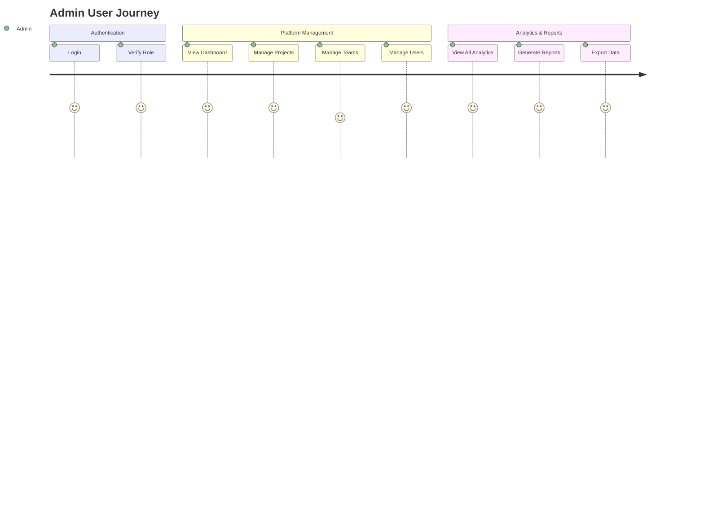
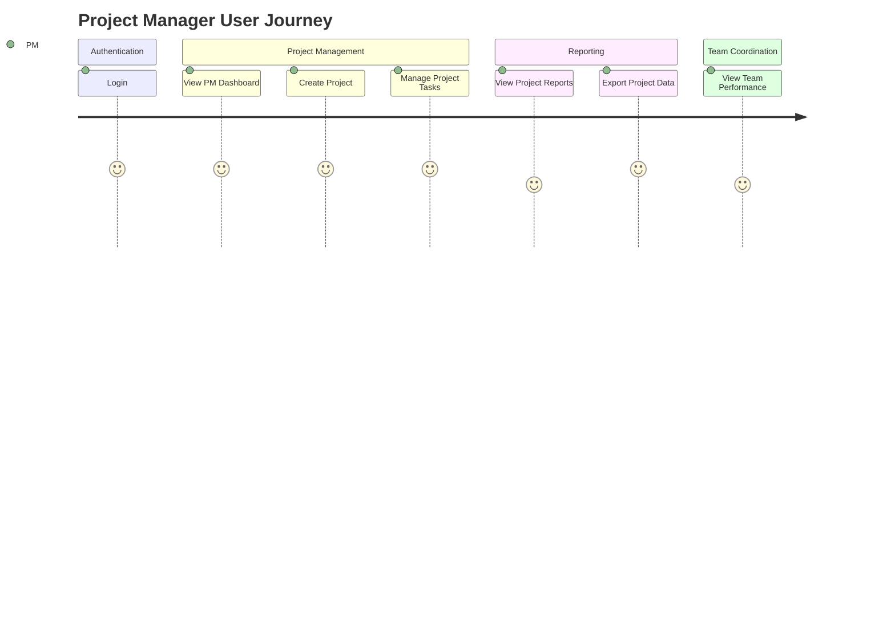
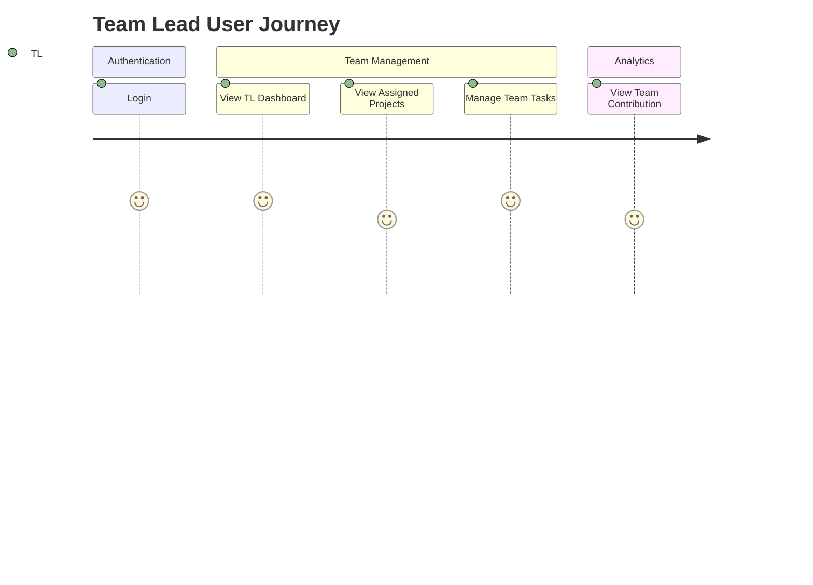
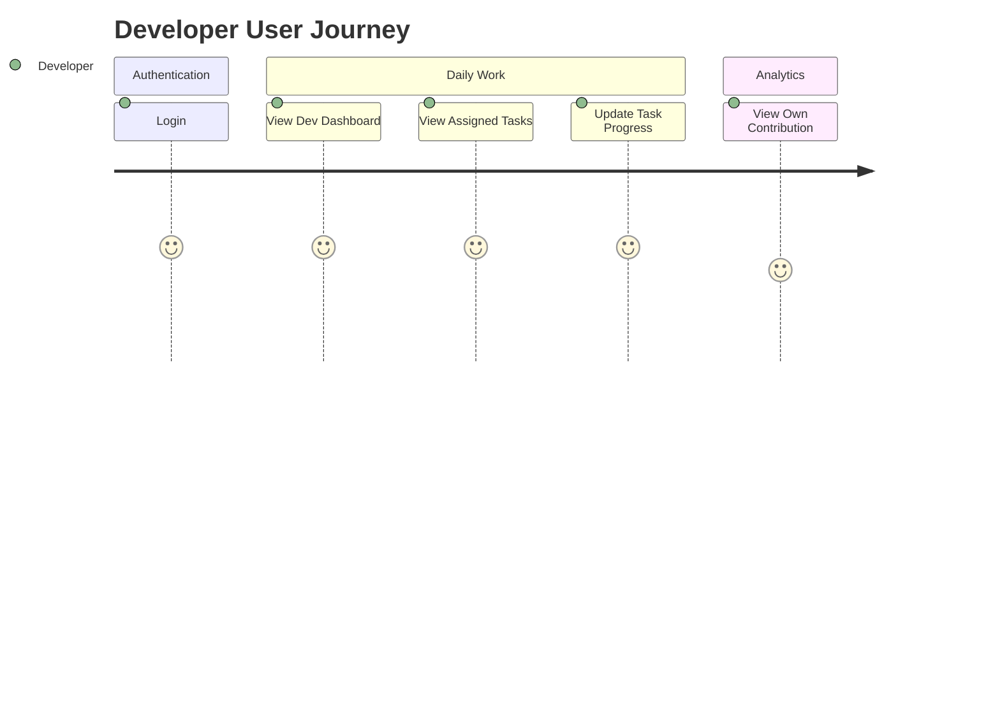
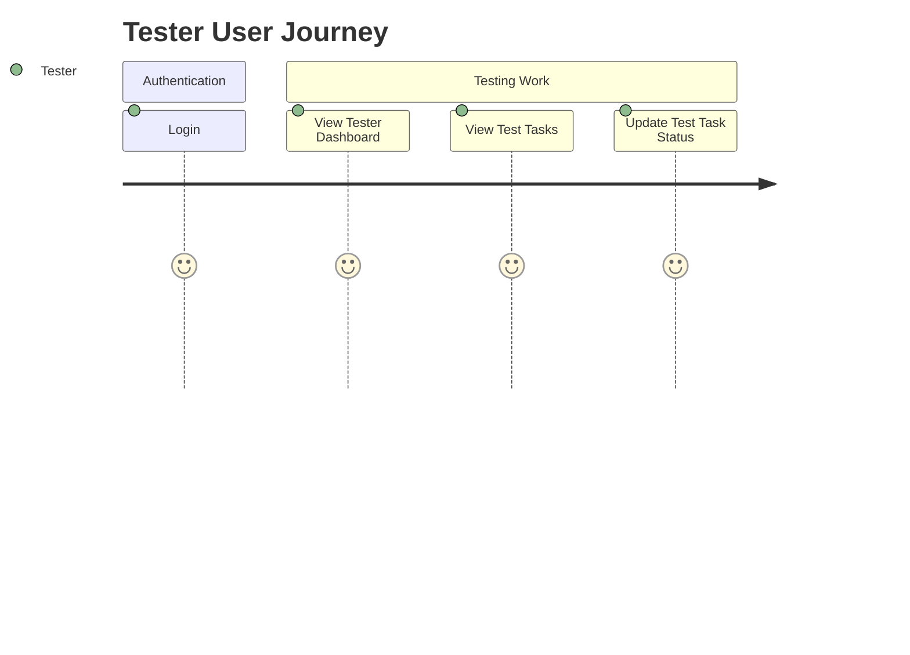
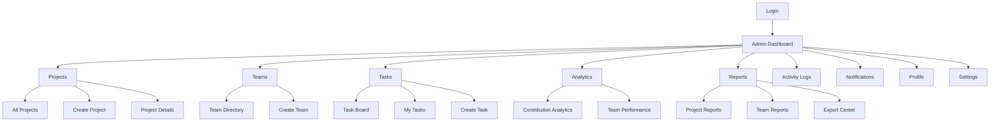
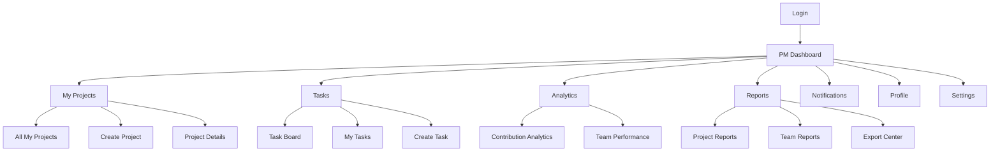
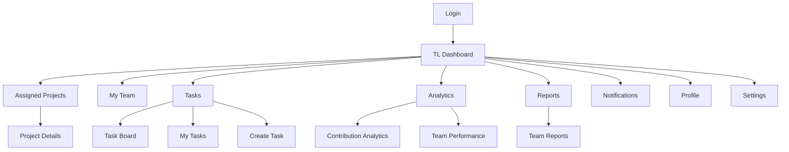

# DevMetrics Phase-1 RBAC System Design
## Role-Based Access Control System
---

## 1. User Roles & Responsibilities

### Role: Admin
| Attribute | Details |
|-----------|---------|
| **Description** | Full platform access and control. Manages users, teams, projects, and system settings. |
| **Responsibilities** | - Manage all users (add/remove/assign roles)<br>- Manage all teams and projects<br>- Configure platform settings<br>- Monitor all activity logs<br>- Access all analytics and reports |
| **Allowed Actions** | All actions across all modules |
| **Restricted Actions** | None |

### Role: Project Manager (PM)
| Attribute | Details |
|-----------|---------|
| **Description** | Manages projects, tasks, and team allocation. Tracks project progress and generates reports. |
| **Responsibilities** | - Create and manage assigned projects<br>- Assign tasks to team members<br>- Monitor project progress and health<br>- Generate project reports<br>- View team performance |
| **Allowed Actions** | - Create/edit/delete own projects<br>- Assign tasks<br>- View and export project reports<br>- Manage project settings |
| **Restricted Actions** | - Manage users/roles<br>- System-wide settings<br>- Other teams' projects |

### Role: Team Lead (TL)
| Attribute | Details |
|-----------|---------|
| **Description** | Leads a specific team, manages team tasks and performance. |
| **Responsibilities** | - Manage team's tasks and workload<br>- Monitor team's contributions<br>- Coordinate with project managers<br>- View team performance analytics |
| **Allowed Actions** | - View and edit assigned projects<br>- Manage team tasks<br>- View team reports |
| **Restricted Actions** | - Create/delete projects<br>- Manage other teams<br>- System settings |

### Role: Developer
| Attribute | Details |
|-----------|---------|
| **Description** | Writes code, contributes to projects, manages own tasks. |
| **Responsibilities** | - Complete assigned tasks<br>- View project details<br>- Update task progress<br>- View own contribution analytics |
| **Allowed Actions** | - View assigned projects/tasks<br>- Update own tasks<br>- View own contribution stats |
| **Restricted Actions** | - Create/edit/delete projects<br>- Manage teams/users<br>- Generate reports |

### Role: Tester
| Attribute | Details |
|-----------|---------|
| **Description** | Tests software, manages test tasks, reports bugs. |
| **Responsibilities** | - Execute test tasks<br>- Report and track bugs<br>- View test-related project details |
| **Allowed Actions** | - View assigned projects/tasks<br>- Update test tasks<br>- View test-related analytics |
| **Restricted Actions** | - Create/edit/delete projects<br>- Manage teams/users<br>- Generate reports |

---

## 2. Permission Matrix
| Screen | Admin | PM | TL | Developer | Tester |
|--------|-------|----|----|-----------|--------|
| **Login** | ✅ | ✅ | ✅ | ✅ | ✅ |
| **Register** | ✅ | ✅ | ✅ | ✅ | ✅ |
| **Forgot Password** | ✅ | ✅ | ✅ | ✅ | ✅ |
| **Dashboard** | ✅ Full | ✅ PM View | ✅ TL View | ✅ Dev View | ✅ Tester View |
| **Projects** | ✅ Full | ✅ Full (own) | ✅ View/Edit | ✅ View | ✅ View |
| **Create Project** | ✅ | ✅ | ❌ | ❌ | ❌ |
| **Project Details** | ✅ Full | ✅ Full (own) | ✅ View/Edit | ✅ View | ✅ View |
| **Team Directory** | ✅ Full | ✅ View | ✅ View (own team) | ✅ View (own team) | ✅ View (own team) |
| **Create Team** | ✅ | ❌ | ❌ | ❌ | ❌ |
| **Task Board** | ✅ Full | ✅ Full (own projects) | ✅ View/Edit (team) | ✅ View/Edit (own) | ✅ View/Edit (own) |
| **My Tasks** | ✅ | ✅ | ✅ | ✅ | ✅ |
| **Create Task** | ✅ | ✅ | ✅ | ❌ | ❌ |
| **Contribution Analytics** | ✅ Full | ✅ View | ✅ View (team) | ✅ View (own) | ✅ View (own) |
| **Team Performance** | ✅ Full | ✅ View | ✅ View (own team) | ❌ | ❌ |
| **Project Reports** | ✅ Full | ✅ Full | ✅ View | ❌ | ❌ |
| **Team Reports** | ✅ Full | ✅ View | ✅ View (own team) | ❌ | ❌ |
| **Export Center** | ✅ Full | ✅ Full (own projects) | ❌ | ❌ | ❌ |
| **Activity Logs** | ✅ Full | ✅ View (own projects) | ✅ View (team) | ❌ | ❌ |
| **Notifications** | ✅ | ✅ | ✅ | ✅ | ✅ |
| **Profile** | ✅ | ✅ | ✅ | ✅ | ✅ |
| **Settings** | ✅ Full | ✅ Project Settings | ✅ Team Settings | ✅ Personal | ✅ Personal |

---

## 3. Role-Based Sidebar Navigation
### Admin Sidebar
```
├── Dashboard
├── Projects
│   ├── All Projects
│   └── Create Project
├── Teams
│   ├── Team Directory
│   └── Create Team
├── Tasks
│   ├── Task Board
│   ├── My Tasks
│   └── Create Task
├── Analytics
│   ├── Contribution Analytics
│   └── Team Performance
├── Reports
│   ├── Project Reports
│   ├── Team Reports
│   └── Export Center
├── Activity Logs
├── Notifications
├── Profile
└── Settings
```

### Project Manager (PM) Sidebar
```
├── Dashboard
├── Projects
│   ├── My Projects
│   └── Create Project
├── Tasks
│   ├── Task Board
│   ├── My Tasks
│   └── Create Task
├── Analytics
│   ├── Contribution Analytics
│   └── Team Performance
├── Reports
│   ├── Project Reports
│   ├── Team Reports
│   └── Export Center
├── Notifications
├── Profile
└── Settings
```

### Team Lead (TL) Sidebar
```
├── Dashboard
├── Projects
│   └── Assigned Projects
├── Teams
│   └── My Team
├── Tasks
│   ├── Task Board
│   ├── My Tasks
│   └── Create Task
├── Analytics
│   ├── Contribution Analytics
│   └── Team Performance
├── Reports
│   └── Team Reports
├── Notifications
├── Profile
└── Settings
```

### Developer Sidebar
```
├── Dashboard
├── Projects
│   └── Assigned Projects
├── Tasks
│   ├── Task Board
│   └── My Tasks
├── Analytics
│   └── My Contribution Analytics
├── Notifications
├── Profile
└── Settings
```

### Tester Sidebar
```
├── Dashboard
├── Projects
│   └── Assigned Projects
├── Tasks
│   ├── Task Board
│   └── My Tasks
├── Notifications
├── Profile
└── Settings
```

---

## 4. Mermaid User Journey Diagrams
### Admin User Journey


### Project Manager User Journey


### Team Lead User Journey


### Developer User Journey


### Tester User Journey


---

## 5. Mermaid Navigation Flow Diagrams
### Admin Navigation Flow


### Project Manager Navigation Flow


### Team Lead Navigation Flow


---

## 6. Dashboard Widgets by Role
### Admin Dashboard Widgets
- All Projects Overview
- All Teams Overview
- System Activity Summary
- Platform Health
- User Management Quick Access

### PM Dashboard Widgets
- My Projects Overview
- Project Progress Trackers
- Team Workload Summary
- Project Health Indicators
- Recent Project Activity

### TL Dashboard Widgets
- Assigned Projects Overview
- Team Task Summary
- Team Contribution Stats
- Team Performance Metrics

### Developer Dashboard Widgets
- My Assigned Tasks
- My Contribution Stats
- Recent Project Updates
- Upcoming Deadlines

### Tester Dashboard Widgets
- My Test Tasks
- Test Coverage Summary
- Bug Report Stats
- Recent Test Activity

---

## 7. Module & Feature Access Summary
| Module | Admin | PM | TL | Developer | Tester |
|--------|-------|----|----|-----------|--------|
| **Authentication** | ✅ | ✅ | ✅ | ✅ | ✅ |
| **Dashboard** | ✅ | ✅ | ✅ | ✅ | ✅ |
| **Projects** | ✅ | ✅ | ✅ | ✅ | ✅ |
| **Teams** | ✅ | ✅ | ✅ | ✅ | ✅ |
| **Tasks** | ✅ | ✅ | ✅ | ✅ | ✅ |
| **Analytics** | ✅ | ✅ | ✅ | ✅ | ❌ |
| **Reports** | ✅ | ✅ | ✅ | ❌ | ❌ |
| **Export** | ✅ | ✅ | ❌ | ❌ | ❌ |
| **Activity Logs** | ✅ | ✅ | ✅ | ❌ | ❌ |
| **Notifications** | ✅ | ✅ | ✅ | ✅ | ✅ |
| **Profile** | ✅ | ✅ | ✅ | ✅ | ✅ |
| **Settings** | ✅ | ✅ | ✅ | ✅ | ✅ |

---

## 8. Implementation Notes
- All routes should be protected using the `ProtectedRoute` component
- Role checks should happen both client-side (for UI) and server-side (for API)
- Use localStorage to persist authentication state
- Sidebar should dynamically render based on the current user's role
- Access denied page should redirect users to their appropriate dashboard
